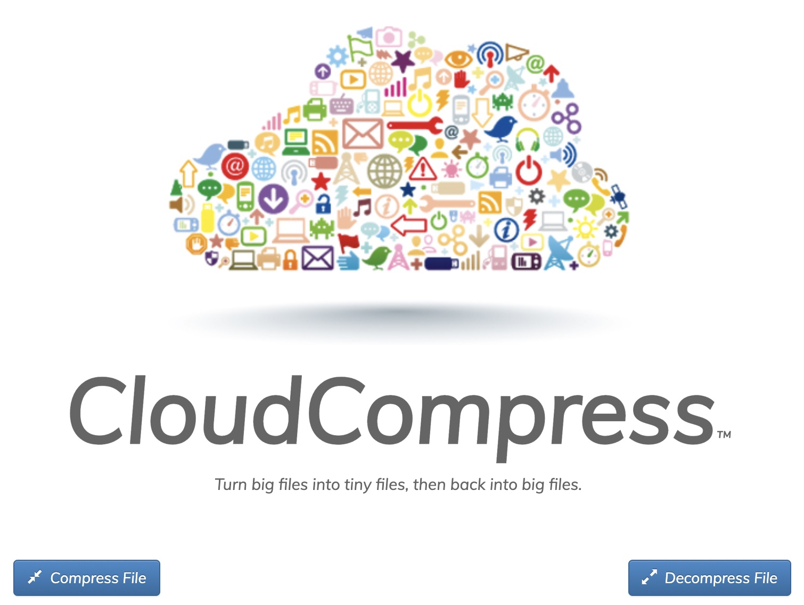
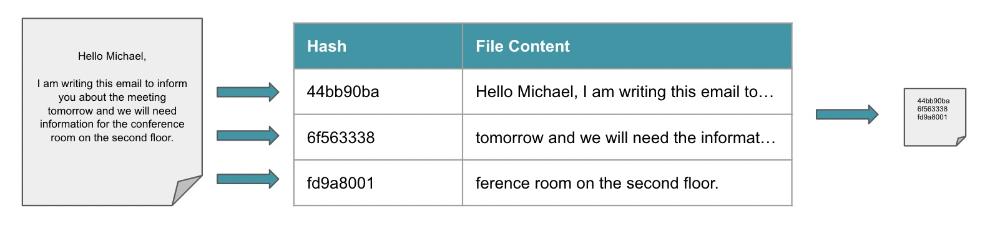
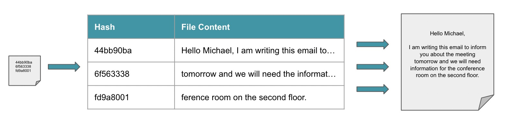

# Cloud Compress
Cloud Compress converts files into tiny versions of themselves by hashing binary blobs of the files into hashes. With the hashes being much smaller than the binary blobs, we achieve levels of file compression that surpass most common compression algorithms by far. 

[View Demo](http://www.akaninyene.com:8000/)



## Usage

**Dependencies**: PHP, Sqlite3

Create the database for the hash_table in the project directory.
```
% sqlite3 database.sqlite

sqlite> CREATE TABLE hash_table(
hash_table_hash TEXT PRIMARY KEY,
hash_table_val  TEXT
);
```
From the project repository run the following command, then navigate to http://localhost:8000 from a web browser.
```
php -S localhost:8000
```

## File Compression
Compression is achieved by hashing 2^16 or 65,536 byte binary chunks of files into 4 byte crc32 hashes. This produces a compression ratio of of 16,384:1, which translates to a compression rate of 99.99%. The compressed file is produced from the hashes of the binary chunks of the original file.



## File Decompression
This process can be reversed to decompress files. The compressed file is decompressed by looking up the file content for each hash value, then converting the hashed content to the original file's content.



## Future Work

Anybody is free to fork this repository and improve on Cloud Compress. Feel free to submit a pull request if you would like to contribute. Some limitations and potential improvements are:
- Due to limitations with PHP server file size limits, we only tested files up to 2MB in size. It is possible that larger files may not add significantly to the overhead as the amount of time to perform file conversions and database operations may not increase linearly.
- It is possible that multiple combinations of file contents can lead to the same hash, which can cause collisions. Additional columns can be utilized to implement sanity checks to make sure that the file content that is selected in the case of a collision is for the appropriate file.
- Individual hashes can be reversed, not easily, but possibly. Utilizing encryption can add data obfuscation so that individual binary chunks are not reversible in database.
